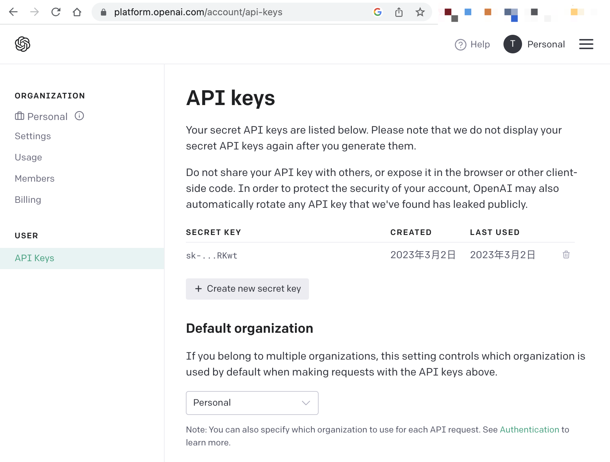
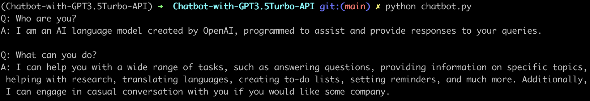

# Chatbot-with-GPT3.5Turbo-API
A simple Python chatbot implemented with official OpenAI API using model `gpt-3.5-turbo`. ChatGPT is powered by `gpt-3.5-turbo`, OpenAI’s most advanced language model.

It's much fun to find that:

1. Using the API to access ChatGPT is *much faster* than directly using the web version of ChatGPT.
2. Replies from ChatGPT are *delivered all at once*, rather than one character at a time.
3. Even in restricted areas(like China mainland), *direct access* is possible without the need for a VPN.

## How to use
1.clone code from github 

```bash
git clone git@github.com:fiatrete/Chatbot-with-GPT3.5Turbo-API.git
cd Chatbot-with-GPT3.5Turbo-API
```

2.setup and activate venv

```bash
python3 -m venv .
source bin/activate
```

3.install openai lib

```bash
pip install openai
```	

4.get your API Keys from `https://platform.openai.com/account/api-keys`, and set `openai.api_key` in code.



5.run and have fun


